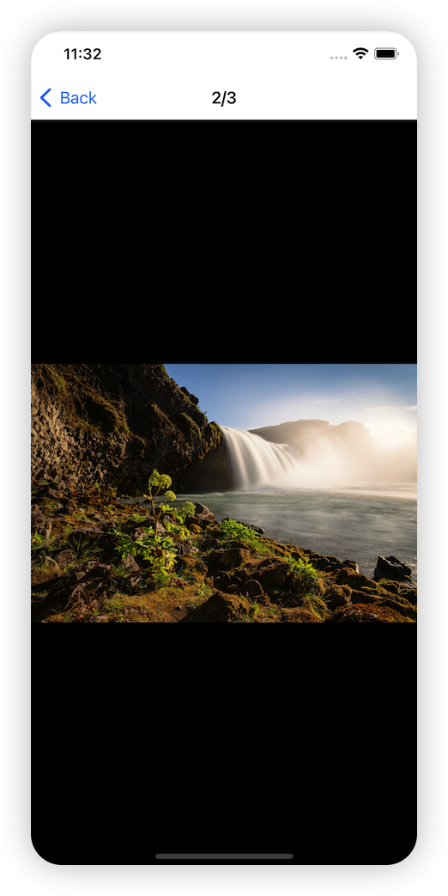

### XUIImagePreviewer

 使用swift实现的iOS端图片预览工具

### Main Class

`UIImagePreviewController`

Params: 
- `imageArray` : UIImage Array
- `position` : the location of the first image to be displayed
- `bgColor` : page background color


### Usage

```swift
 self?.navigationController?.pushViewController(UIImagePreviewController(imageArray: targets, bgColor: .black), animated: true)
```

### SnapShot



### Else

[过程与问题记录](./%E8%BF%87%E7%A8%8B%E4%B8%8E%E9%97%AE%E9%A2%98%E8%AE%B0%E5%BD%95.md)