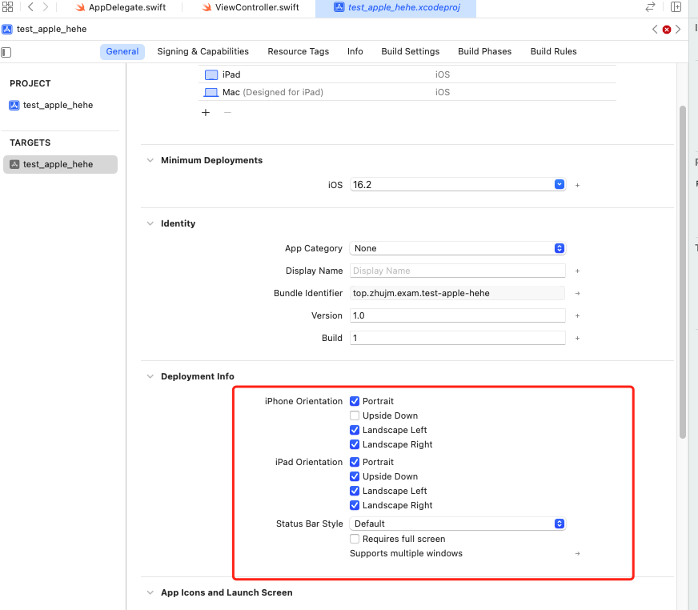
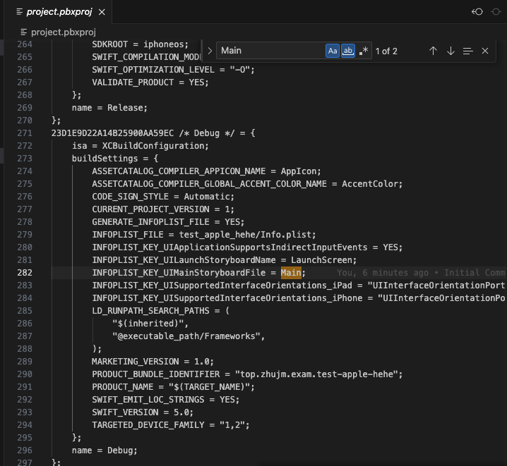
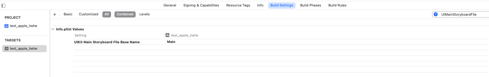
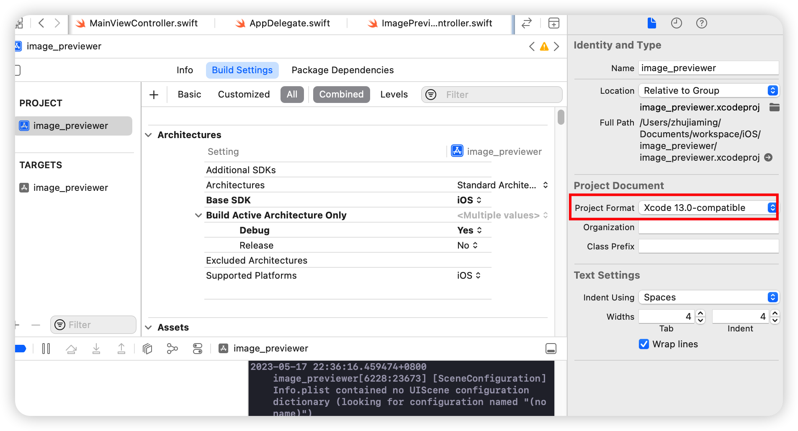

项目环境:
macOS Monterey 12.6.3
xCode 14.2 (14C18)

## 实现原理

iOS的UIScrollView居然有缩放页面的效果（安卓真没这个特性），类似WebView的网页的缩放，所以基于UIScrollView实现了图片的预览切换，可以方便的查看多张图片。

## 新建工程

#### 无storyboard的配置错误

删除storyboard配置运行过程中遇到报错：

> Could not find a storyboard named 'Main' in bundle NSBundle ...

删除main.storyboard的相关配置时，按照网上步骤发现这个配置不存在了，xCode项目中并没有Main Interface的选项。

真是奇了怪了，可能是版本更新导致的，只能靠检索关键字来查找了，通过以文本方式打开  `project.pbxproj` ,搜索 `Main` 就找到了这个配置所在的位置：

反向定位，原来是搁这了：

最后删除了这个配置，成功运行。

## 引入Pod库

### pod命令报错

需要在项目根目录下执行 `pod init` ，生成一个 Podfile 文件，但命令始终报错:

> /Library/Ruby/Gems/2.6.0/gems/cocoapods-1.12.0/lib/cocoapods/user_interface/error_report.rb:34:in `force_encoding': **can't modify frozen String (FrozenError)**

查询一番资料后发现应该和xcode版本有关，需要将 Project Format 的Xcode 14.0-compatible 设置为：Xcode 13.0-compatible

## 开发过程

### 路由跳转无效

pushViewController未执行路由跳转

需要将rootViewController设置为UINavigationController：
self.window?.rootViewController = UINavigationController(rootViewController: MainViewController())

### 预览图片初始位置不居中

由于预览图片是基于UIScrollView实现，UIScrollView与整个屏幕有联动效果。
进入图片预览页面后，发现初始显示的图片位置始终居下，点击屏幕后就恢复到中间位置了。

分析原因
不居中时，根据背景色判断scrollView处于全屏状态，这种只有滚动时才出现，所以可能是系统的某种联动效果，导致初始时scrollView计算的高度没有按照实际内容的高度而是按照屏幕高度计算的。

处理
设置 `UIViewController` 的 `edgesForExtendedLayout = []`

>edgesForExtendedLayout是一个UIViewController的属性，用于指定视图控制器的视图是否延伸到边缘。它可以设置为left、right、top、bottom、all、none或这些组合。在iOS 7及以上版本中，默认情况下，视图控制器的视图会延伸到屏幕的边缘。可以通过设置edgesForExtendedLayout属性来控制视图是否延伸到导航栏、状态栏等系统提供的视图下面。例如，将edgesForExtendedLayout属性设置为UIRectEdge.bottom可以让视图控制器的视图不延伸到底部。

